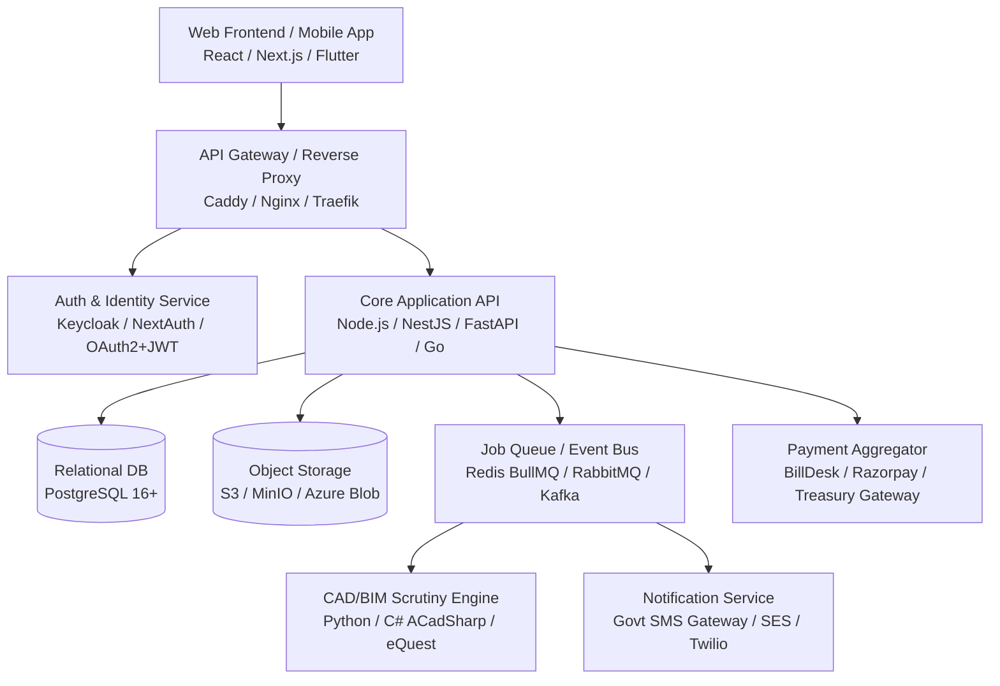
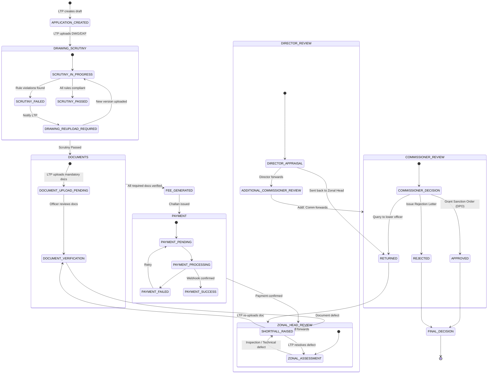

# Automated Building Permission & Scrutiny Management System (BBAS)
## Complete System Architecture, Functional Specification & Implementation Blueprint

---

### Executive Overview & Purpose

The **Building Byelaw Automated Scrutiny & Approval System (BBAS)** is an enterprise-grade, government-to-citizen (G2C) and government-to-business (G2B) digital governance platform designed for municipal corporations and urban development authorities (modeled after APCRDA / Amaravati Capital City regulations and Andhra Pradesh Building Rules 2017).

The primary objective of this platform is to provide a **single-window, end-to-end automated building permit lifecycle**:
1. **Automated 2D CAD & 3D BIM Rule Scrutiny**: Validating architectural and structural drawings against statutory town planning regulations (setbacks, ground coverage, FAR/FSI, building height, parking ECS, fire escape stairs, rainwater harvesting, landscape norms) in seconds without manual measurement bias.
2. **Transparent, Multi-Tier Approval Workflow**: Orchestrating an immutable, SLA-bound hierarchical review chain from Licensed Technical Persons (LTPs) through Town Planning Assistants (TPAs), Zonal Deputy Directors (ZDDs), Zonal Joint Directors (ZJDs), Zonal Heads, Directors, Additional Commissioners, and the Municipal/Authority Commissioner.
3. **Integrated Post-Sanction Lifecycle Management**: Covering site inspections with geo-tagged photographic evidence, multi-agency NOC clearances (Fire, Airport, Environmental, Traffic, Revenue), defect/shortfall remediation, work commencement intimation (Form 5), permit revocations, show-cause proceedings, and Occupancy Certificate (OC) issuance.
4. **Statutory Fee & Accounting Engine**: Dynamic, area- and slab-based fee computation with configurable GST/tax rules, statutory labour welfare cess, online payment gateway integration, challan generation, and automated treasury reconciliation.

This blueprint contains the **complete functional and technical specifications** required to rebuild this entire system from scratch on any modern tech stack.

---

## 1. System Architecture & Technology Stack

### 1.1 Existing Architecture Overview
The current repository is implemented as a full-stack Next.js application:
- **Framework**: Next.js 16.3+ (App Router, Turbopack, React 19, TypeScript 5)
- **Styling**: Tailwind CSS v4, PostCSS, Radix UI primitives, Lucide Icons, Sonner toasts
- **State Management**: Zustand with persistent storage (`app-store.ts`) for single-source-of-truth client-side state
- **CAD & 3D Visualization**: Three.js for 3D BIM model rendering; D3-path / Canvas / SVG for 2D DWG/DXF drawings and setback overlay scrutiny
- **Database / ORM**: Prisma ORM with PostgreSQL (Neon DB pooler)
- **Document & File Handling**: Client-side ArrayBuffer storage & base64/blob abstraction (`file-store.ts`)

### 1.2 Target Production Architecture for Independent Rebuild

When building this project in an enterprise, production-ready environment, the recommended clean-architecture stack is structured as follows:



#### Recommended Target Stack Components:
- **Frontend**: Next.js 16 (App Router) or Vite + React 19, TypeScript, Tailwind CSS, Shadcn UI / Radix UI, TanStack Query, Zustand.
- **Backend API**: NestJS (TypeScript) or FastAPI (Python) or Go (Gin/Fiber).
- **Database**: PostgreSQL 16+ with PostGIS extension (for land parcels, zone boundaries, GIS coordinates).
- **ORM / Query Builder**: Prisma v6 or Drizzle ORM or SQLAlchemy.
- **Object Storage**: AWS S3 or MinIO (on-premises) with pre-signed upload URLs and server-side encryption for legal documents and DWG drawings.
- **CAD Parsing Engine**: Python worker utilizing `ezdxf` / `ACadSharp` / C# standalone microservice that extracts polylines, layers, blocks, and text annotations from DWG/DXF files and returns structured JSON scrutiny results.
- **Job Processing**: Redis + BullMQ (Node.js) or Celery (Python) for asynchronous drawing scrutiny, PDF stamp generation, and SMS/Email dispatching.

---

## 2. Stakeholder Roles & Granular RBAC Matrix

The system features **9 distinct stakeholder roles** organized by administrative hierarchy and jurisdiction.

### 2.1 Role Definitions & Hierarchy

| Role Key | Title | Hierarchy Level | Target Portal | Description & Scope |
|---|---|:---:|:---:|---|
| **LTP** | Licensed Technical Person | Level 0 | LTP Portal | Architects, Engineers, Structural Designers, Town Planners registered with the Authority. Submits plans, uploads drawings, pays fees, responds to shortfalls. |
| **TPA** | Town Planning Assistant | Level 1 | Officer Portal | Field-level planning officer. Conducts technical drawing scrutiny, verifies land documents, inspects site, drafts shortfall queries. |
| **ZDD** | Zonal Deputy Director | Level 2 | Officer Portal | Middle-level planning officer. Reviews TPA reports, verifies fee assessments, reviews shortfall responses, forwards files to ZJD. |
| **ZJD** | Zonal Joint Director | Level 3 | Officer Portal | Senior zonal officer. Assesses complex residential and commercial files, validates setback variances, forwards files to Director. |
| **ZONAL_HEAD** | Zonal Head | Level 2 | Officer Portal | Administrative head of a municipal zone. Oversees all zonal applications, assigns officers, validates zonal documents. |
| **DIRECTOR** | Director of Planning | Level 4 | Officer Portal | Authority-wide planning head. Appraises high-rise, commercial, and layout files, reviews inter-departmental NOCs. |
| **ADDITIONAL_COMMISSIONER** | Additional Commissioner | Level 5 | Officer Portal | Senior administrative review prior to executive sanction. Can approve within delegated financial/area thresholds. |
| **COMMISSIONER** | Municipal / Authority Commissioner | Level 6 | Officer Portal | Supreme Permitting Authority. Issues final Development Permission Orders (DPO), sanctions, rejections, and revocations. |
| **ADMIN** | System Administrator | Level 90 | Admin Console | Platform administrator. Manages user accounts, role definitions, fee structures, application types, workflow routes, and audit trails. |

---

### 2.2 Granular Permissions (30 Permissions)

```typescript
export type Permission =
  // Application Lifecycle
  | "application:create"           // Create new building permit application
  | "application:view_own"          // View applications owned by current LTP
  | "application:view_all"          // View applications across all zones/users
  // Drawing & Scrutiny
  | "drawing:upload"               // Upload DWG, DXF, or PDF drawings
  | "drawing:view"                 // View drawing sheets & interactive canvas
  | "drawing:scrutinize"           // Run automated rule engine & record findings
  // Document Management
  | "document:upload"              // Upload ownership, NOC, structural certificates
  | "document:view"                // View and preview uploaded documents
  | "document:verify"              // Stamp document as VERIFIED
  | "document:reject"              // Mark document as REJECTED
  // Fees & Accounting
  | "fee:calculate"                // Trigger dynamic fee computation
  | "fee:manage"                   // Configure fee structures, components, and tax rules
  | "payment:initiate"             // Generate payment challan & trigger payment
  | "payment:verify"               // Reconcile and verify payment receipts
  // Workflow & Decision Engine
  | "workflow:approve"             // Grant sanction or approve stage
  | "workflow:forward"             // Forward application to next hierarchy tier
  | "workflow:return"              // Return file to lower tier for clarification
  | "workflow:reject"              // Issue formal rejection order
  // Defect / Shortfall Management
  | "shortfall:raise"              // Raise formal shortfall / query notice
  | "shortfall:view"               // View shortfall details and history
  | "shortfall:resolve"            // Mark shortfall as resolved upon review
  // Case Notes & Remarks
  | "remarks:add"                  // Add internal notes, observation, or instruction
  // System Administration & Monitoring
  | "user:manage"                  // Create, update, deactivate users
  | "role:manage"                  // Configure role definitions and perms
  | "config:manage"                // Update application types and system settings
  | "audit:view"                   // View immutable system audit logs
  | "notifications:manage"         // Configure SMS/Email templates & dispatch logs
  | "reports:view"                 // View MIS performance & revenue dashboards
  | "officer_progress:view"        // Monitor officer-wise file pendency
  | "sla:view";                    // Monitor SLA countdowns and overdue files
```

---

### 2.3 Comprehensive Role vs. Permission Matrix

| Permission | LTP | TPA | ZDD | ZJD | ZONAL_HEAD | DIRECTOR | ADDL_COMM | COMMISSIONER | ADMIN |
|---|:---:|:---:|:---:|:---:|:---:|:---:|:---:|:---:|:---:|
| `application:create` | ✅ | ❌ | ❌ | ❌ | ❌ | ❌ | ❌ | ❌ | ❌ |
| `application:view_own` | ✅ | ❌ | ❌ | ❌ | ❌ | ❌ | ❌ | ❌ | ❌ |
| `application:view_all` | ❌ | ✅ | ✅ | ✅ | ✅ | ✅ | ✅ | ✅ | ✅ |
| `drawing:upload` | ✅ | ❌ | ❌ | ❌ | ❌ | ❌ | ❌ | ❌ | ❌ |
| `drawing:view` | ✅ | ✅ | ✅ | ✅ | ✅ | ✅ | ✅ | ✅ | ✅ |
| `drawing:scrutinize` | ✅ | ✅ | ✅ | ✅ | ❌ | ❌ | ❌ | ❌ | ❌ |
| `document:upload` | ✅ | ❌ | ❌ | ❌ | ❌ | ❌ | ❌ | ❌ | ❌ |
| `document:view` | ✅ | ✅ | ✅ | ✅ | ✅ | ✅ | ✅ | ✅ | ✅ |
| `document:verify` | ❌ | ✅ | ✅ | ✅ | ✅ | ❌ | ❌ | ❌ | ❌ |
| `document:reject` | ❌ | ✅ | ✅ | ✅ | ✅ | ❌ | ❌ | ❌ | ❌ |
| `fee:calculate` | ✅ | ✅ | ✅ | ✅ | ✅ | ✅ | ✅ | ✅ | ✅ |
| `fee:manage` | ❌ | ❌ | ✅ | ✅ | ❌ | ❌ | ✅ | ✅ | ✅ |
| `payment:initiate` | ✅ | ❌ | ❌ | ❌ | ❌ | ❌ | ❌ | ❌ | ❌ |
| `payment:verify` | ❌ | ✅ | ✅ | ✅ | ✅ | ✅ | ✅ | ✅ | ✅ |
| `workflow:approve` | ❌ | ❌ | ✅ | ✅ | ✅ | ✅ | ✅ | ✅ | ❌ |
| `workflow:forward` | ❌ | ❌ | ✅ | ✅ | ✅ | ✅ | ✅ | ❌ | ❌ |
| `workflow:return` | ❌ | ❌ | ✅ | ✅ | ✅ | ✅ | ❌ | ✅ | ❌ |
| `workflow:reject` | ❌ | ❌ | ❌ | ❌ | ❌ | ❌ | ❌ | ✅ | ❌ |
| `shortfall:raise` | ❌ | ✅ | ✅ | ✅ | ✅ | ✅ | ❌ | ❌ | ❌ |
| `shortfall:view` | ✅ | ✅ | ✅ | ✅ | ✅ | ✅ | ✅ | ✅ | ✅ |
| `shortfall:resolve` | ❌ | ✅ | ✅ | ✅ | ✅ | ✅ | ❌ | ❌ | ❌ |
| `remarks:add` | ✅ | ✅ | ✅ | ✅ | ✅ | ✅ | ✅ | ✅ | ✅ |
| `user:manage` | ❌ | ❌ | ✅ | ✅ | ❌ | ❌ | ✅ | ✅ | ✅ |
| `role:manage` | ❌ | ❌ | ✅ | ✅ | ❌ | ❌ | ✅ | ✅ | ✅ |
| `config:manage` | ❌ | ❌ | ✅ | ✅ | ❌ | ❌ | ✅ | ✅ | ✅ |
| `audit:view` | ❌ | ❌ | ✅ | ✅ | ❌ | ❌ | ✅ | ✅ | ✅ |
| `notifications:manage` | ❌ | ❌ | ✅ | ✅ | ❌ | ❌ | ✅ | ✅ | ✅ |
| `reports:view` | ❌ | ❌ | ✅ | ✅ | ❌ | ❌ | ✅ | ✅ | ✅ |
| `officer_progress:view` | ❌ | ❌ | ✅ | ✅ | ❌ | ❌ | ✅ | ✅ | ✅ |
| `sla:view` | ❌ | ❌ | ✅ | ✅ | ❌ | ❌ | ✅ | ✅ | ✅ |

> **Dynamic Permission Overrides**: The system supports granular per-user overrides via `user.permissionOverrides.allowed` and `user.permissionOverrides.denied`. When the store evaluates permissions, user-level overrides take precedence over role-level defaults.

---

## 3. Workflow Engine & Lifecycle State Machine

The heart of the application is a **10-stage sequential approval workflow** with branching paths for shortfalls, fee payments, and multi-tier officer endorsements.

### 3.1 Workflow State Machine Diagram



---

### 3.2 The 10 Workflow Stages Detailed

| # | Stage Key | Assigned Role | Exit Condition / Trigger | Allowed Actions | Can Raise Shortfall? |
|:---:|---|:---:|---|---|:---:|
| **0** | `APPLICATION_CREATED` | LTP | Basic project details, plot survey, and applicant info submitted. | Form submission | ❌ |
| **1** | `DRAWING_SCRUTINY` | LTP / Engine | Automated CAD scrutiny passes with 0 critical/major errors. | Drawing Upload, Run Scrutiny | ❌ |
| **2** | `DOCUMENTS` | ZONAL_HEAD / TPA | All mandatory ownership and statutory documents verified. | Add Remarks, Verify/Reject Doc | ✅ |
| **3** | `FEE_GENERATED` | LTP | Automated fee assessment generated from plot and built-up area. | View Fee Statement | ❌ |
| **4** | `PAYMENT` | LTP | Payment gateway receipt confirmed and reconciled. | Pay Online, Download Challan | ❌ |
| **5** | `ZONAL_HEAD_REVIEW` | ZONAL_HEAD / ZDD | Zonal inspection report completed, technical appraisal cleared. | Forward, Return, Shortfall, Remarks | ✅ |
| **6** | `DIRECTOR_REVIEW` | DIRECTOR | Senior appraisal completed, inter-departmental clearances verified. | Approve, Forward, Return, Shortfall | ✅ |
| **7** | `ADDITIONAL_COMMISSIONER_REVIEW` | ADDITIONAL_COMMISSIONER | Executive concurrence granted. | Approve, Forward, Remarks | ❌ |
| **8** | `COMMISSIONER_REVIEW` | COMMISSIONER | Final statutory order signed with digital certificate and QR. | Approve, Reject, Return, Remarks | ❌ |
| **9** | `FINAL_DECISION` | COMMISSIONER | Development Permission Order (DPO) or Rejection Notice dispatched. | Outward Dispatch, View Certificate | ❌ |

---

### 3.3 The 20 Application Statuses

```typescript
export type ApplicationStatus =
  | "DRAFT"                          // Initial unsubmitted state
  | "DRAWING_UPLOADED"              // DWG file uploaded, awaiting scrutiny
  | "SCRUTINY_IN_PROGRESS"          // Parser analyzing layers and geometry
  | "SCRUTINY_FAILED"               // Violations detected in drawing
  | "DRAWING_REUPLOAD_REQUIRED"     // LTP instructed to upload revised CAD file
  | "SCRUTINY_PASSED"               // Zero critical violations, ready for documents
  | "DOCUMENT_UPLOAD_PENDING"       // Awaiting mandatory document uploads
  | "DOCUMENT_VERIFICATION"         // Officer reviewing uploaded PDFs/affidavits
  | "FEE_GENERATED"                 // Fee computed, payment challan generated
  | "PAYMENT_PENDING"               // Awaiting payment from LTP/owner
  | "PAYMENT_PROCESSING"            // Gateway webhook in flight
  | "PAYMENT_SUCCESS"               // Payment received, entering officer workflow
  | "PAYMENT_FAILED"                // Transaction failed or canceled
  | "ZONAL_HEAD_REVIEW"             // In Zonal Town Planning office queue
  | "DIRECTOR_REVIEW"               // In Planning Directorate queue
  | "ADDITIONAL_COMMISSIONER_REVIEW"// In Addl. Commissioner queue
  | "COMMISSIONER_REVIEW"           // In Municipal Commissioner queue
  | "SHORTFALL_RAISED"              // Clock paused, awaiting applicant remediation
  | "APPROVED"                      // Sanction granted; DPO permit issued
  | "REJECTED"                      // Application formally rejected
  | "RETURNED";                     // File pushed back to lower tier for re-examination
```

---

## 4. The 24 Functional Modules: In-Depth Specifications

### Module 1: Authentication, OTP & Identity Management
- **Purpose**: Secure multi-tier authentication for private citizens, registered professionals (LTPs), government officers, and system administrators.
- **Key Capabilities**:
  - Email/Password login with bcrypt hashing.
  - Role switcher for testing and administrative delegation.
  - OTP verification flow (simulating Aadhaar-linked mobile OTP required for government land portals).
  - Password recovery workflow with token expiration.
  - Session management with automatic inactivity timeout (configurable via System Settings).
  - Multi-portal routing: LTP users automatically route to `LTP Portal`, Officers route to `Officer Workbench`, Admins route to `Admin Dashboard`.

### Module 2: Unified & Role-Specific Dashboards
- **Purpose**: Contextual landing experiences for every stakeholder tier.
- **Key Capabilities**:
  - **LTP Dashboard**: Quick metrics on Active Applications, Pending Scrutinies, Open Shortfalls, and Fee Dues. Direct actions for "New Application", "Track File", and "Recent Notices".
  - **Officer Dashboard**: Zonal queue summary, pending files categorized by SLA status (Green: >5 days remaining, Amber: 2-5 days, Red: <2 days or Overdue), recent approvals and rejections.
  - **Admin Command Center**: System-wide throughput KPIs, daily submission trends, revenue collections, zone-wise application distribution chart (Bar/Pie charts using Recharts), officer productivity league table.
  - **Project Manager SLA View**: Read-only monitoring of approval velocity, average stage durations, and bottleneck identification across all 9 municipal zones.

### Module 3: Building Permission Application Submission Wizard
- **Purpose**: Multi-step structured questionnaire capturing all legal, technical, and spatial parameters before CAD submission.
- **Forms & Data Captured**:
  1. **Applicant & Landowner Details**: Name, PAN/Aadhaar, Mobile, Email, Communication Address, Power of Attorney / Developer Authorization status.
  2. **Property & Plot Identification**: Zone (Zone-I to Zone-IX), Ward Number, Revenue Village, Survey Number / Plot Number, Abutting Road Width (meters), Land Use Zone (Residential R1/R2, Commercial C1/C2, Industrial, Mixed Use, Institutional).
  3. **Spatial Parameters**: Total Plot Area (sq.m), Proposed Built-up Area (sq.m), Ground Coverage Area (sq.m), Proposed Height (meters), Number of Floors (Stilt + G + N), Basement details.
  4. **Categorization & Route Finder**: Automatically computes whether the file qualifies for:
     - *Instant Self-Certification* (Plots up to 100 sq.m, G+1).
     - *Standard Building Permission* (Plots 100-1000 sq.m, non-high rise <15m).
     - *High-Rise / Commercial Committee Approval* (Height >15m or plot >1000 sq.m requiring multi-agency NOCs).

### Module 4: 2D Drawing Scrutiny Engine & Visualizer
- **Purpose**: Core automated validation engine that scrutinizes CAD files against statutory building rules.
- **Engine Rules & Scrutiny Checks**:
  1. **Front Setback Check**: Compares observed front open space against minimum required setback based on abutting road width and building height (e.g., minimum 6.0m for >12m road).
  2. **Rear & Side Setbacks**: Checks East, West, and Rear open spaces for light, ventilation, and fire tender passage.
  3. **Ground Coverage**: Verifies that (Footprint Area / Plot Area) does not exceed maximum permissible (e.g., 55% to 65% depending on zone).
  4. **FAR / FSI Compliance**: Calculates total floor area divided by plot area; validates against standard permissible FAR + TDR (Transferable Development Rights) or premium FAR allowances.
  5. **Building Height & Road Width Ratio**: Ensures height <= 1.5 × (Abutting Road Width + Front Setback).
  6. **Parking Compliance (ECS)**: Computes required Equivalent Car Spaces based on built-up area and occupancy type (e.g., 1 ECS per 75 sq.m residential built-up area); verifies provided parking stalls and driveway turning radii (minimum 6.0m).
  7. **Environmental & Green Norms**: Verifies presence and dimensions of Rainwater Harvesting (RWH) pits (1 pit per 100 sq.m plot area) and Sewage Treatment Plant (STP) capacity for plots >2000 sq.m.
  8. **Fire Safety & Egress**: Validates minimum stair width (>= 1.5m), maximum travel distance to exit (<= 30m), and refuge area at every 7th floor for high-rises.
- **Output Report**: Structured JSON report (`ScrutinyReport`) detailing Rule, Category, Severity (CRITICAL, MAJOR, MINOR), Status (PASS, FAIL, WARNING), Expected vs. Observed Value, and actionable remediation instructions.

### Module 5: 3D BIM Scrutiny Module
- **Purpose**: Web-based 3D digital twin viewer supporting IFC (Industry Foundation Classes) and glTF models.
- **Key Capabilities**:
  - Interactive Three.js 3D viewport with OrbitControls, panning, zoom, and layer filtering.
  - Architectural, Structural, and MEP (Mechanical, Electrical, Plumbing) model toggles.
  - Floor-by-floor slice view and wireframe collision detection.
  - Visual setback envelope overlay rendering building volume against the legally permissible 3D building envelope.

### Module 6: Document Vault & Verification
- **Purpose**: Repository for all legal, revenue, and technical certificates.
- **Document Taxonomy & Mandatory Codes**:
  - `DOC_712`: 7/12 Land Record Extract / Jamabandi / ROR 1B.
  - `DOC_PROP_CARD`: Town Survey Land Register (TSLR) / Property Card / Mutation Extract.
  - `DOC_ARCH`: Stamped Architectural Working Plans (PDF).
  - `DOC_STRUCT`: Structural Stability Certificate signed by registered Structural Engineer.
  - `DOC_FIRE_NOC`: Provisional No-Objection Certificate from State Fire Services Department.
  - `DOC_ENV`: Environmental Clearance / State Pollution Control Board Consent for Establishment.
  - `DOC_AUTH`: Society / Landowner Registered Development Agreement or Power of Attorney.
  - `DOC_AFFIDAVIT`: Legal Affidavit affirming clear title, ownership, and structural indemnity.
- **Document Lifecycle**: `REQUIRED` → `PENDING_VERIFICATION` → `VERIFIED` | `REJECTED` | `SHORTFALL`.
- **Versioning**: When an LTP re-uploads a rejected document, the old file moves to `SUPERSEDED` and the new file becomes Version N+1 with a complete audit trail.

### Module 7: Fee Engine & Statutory Tax Calculator
- **Purpose**: Configurable, multi-component fee assessment engine.
- **Fee Components**:
  1. `APP_FEE`: Fixed Application Filing Fee (e.g., ₹2,500).
  2. `SCRUTINY_FEE`: Per sq.m charge on total proposed built-up area (e.g., ₹45 / sq.m).
  3. `DEV_FEE`: Infrastructure Development Fee based on plot location and built-up area (e.g., ₹120 / sq.m).
  4. `PROC_FEE`: Administrative Processing & Computer Fee (Fixed ₹1,500).
  5. `DOC_FEE`: Document Archival & Verification Fee (₹800 per uploaded document).
  6. `LABOUR_CESS`: Statutory Building and Other Construction Workers Welfare Cess — **strictly 1% of Development Fee**.
- **Tax Calculation Model**:
  - Configurable per Fee Structure: `CGST_SGST` (9% + 9% = 18%), `IGST` (18%), or `ZERO_TAX` (tax-exempt statutory fee).
  - Immutability: When a fee is assessed and issued to an application, the tax rates and line items are frozen in an immutable snapshot (`ApplicationFee`).

### Module 8: Payment Gateway & Reconciliation
- **Purpose**: Fee collection, challan issuance, and transaction settlement.
- **Key Capabilities**:
  - Payment options: UPI (Google Pay, PhonePe), NetBanking (SBI, HDFC, ICICI, etc.), Debit/Credit Cards, and Treasury Challan / Demand Draft (DD).
  - Transaction verification with gateway reference number (`PGW-TXN-XXXX`).
  - Automated generation of official stamped PDF Receipts with unique Receipt Number (`REC-YYYY-XXXX`).
  - Reconciliation dashboard for accounts officers to audit collections against bank deposits.

### Module 9: Officer Scrutiny Workbench
- **Purpose**: Multi-tab operational workspace for town planning officers (TPA, ZDD, ZJD, Zonal Head).
- **Tabs & Workflows**:
  1. **Application Dossier**: Summary of applicant, plot survey, coordinates, and zoning parameters.
  2. **Technical Scrutiny Review**: Direct inspection of the automated 2D CAD scrutiny checks; ability to endorse or add human observations.
  3. **Document Verification**: Side-by-side PDF previewer with one-click "Verify", "Reject", or "Raise Shortfall" buttons.
  4. **Site Inspection Findings**: View field inspector's uploaded geo-tagged photographs and setback measurement logs.
  5. **Green Notesheet & Remarks**: Official government green-sheet notation trail where each officer appends digital minutes, observations, and recommendations before signing.
  6. **Action Dispatcher**: Forward to next tier, Return to lower tier, Raise Shortfall notice, or Recommend Sanction.

### Module 10: Shortfall & Defect Management
- **Purpose**: Formal legal mechanism to pause the SLA clock and require applicants to remedy defects.
- **Key Capabilities**:
  - Categorization: `DOCUMENT` (missing/illegible deed), `TECHNICAL` (setback violation in drawing), `FEE` (shortfall in remittance), or `GENERAL`.
  - Automated SLA Timer: Imposes a statutory 15-day response window on the applicant.
  - Automated Notification: Dispatches SMS and Email alert containing the shortfall notice and direct response link.
  - LTP Response Portal: Allows LTP to submit written explanations and attach rectified files.
  - Officer Re-verification: Officer reviews response and either marks the shortfall as `RESOLVED` (which unlocks the application workflow) or re-opens the query.

### Module 11: Site Inspection Management
- **Purpose**: Mobile-responsive on-site verification of ground conditions before permit sanction.
- **Key Capabilities**:
  - Inspector assignment with automated scheduling.
  - Standardized inspection checklist:
    - Verification of physical site boundaries against survey records.
    - Check for existing unauthorized constructions or tree cover.
    - Verification of actual abutting road width on site.
    - High-tension electrical line clearance verification.
    - Distance from water bodies, canals, and railway boundaries.
  - Upload of geo-tagged (latitude/longitude/timestamp) photographs from mobile device.
  - Generation of official Field Inspection Report (FIR).

### Module 12: Multi-Agency NOC Management
- **Purpose**: Concurrent, single-window clearance integration with external statutory departments.
- **Clearance Agencies Supported**:
  1. **Fire & Emergency Services**: For buildings >15m height or commercial occupancies >500 sq.m.
  2. **Airport Authority of India (AAI)**: Height clearance under Civil Aviation Colour Coded Zoning Map (CCZM).
  3. **State Pollution Control Board (APPCB)**: Environmental clearance for built-up area >20,000 sq.m.
  4. **Traffic Police Department**: Traffic impact assessment and driveway ingress/egress clearance for malls/theatres.
  5. **Irrigation & Water Resources**: Buffer zone compliance (minimum 9m to 30m from river/canal banks).
  6. **Revenue Department**: Non-Agricultural Land Assessment (NALA) conversion verification.
- **Single-Window Clock**: All NOC agencies receive files concurrently with a synchronized 14-day SLA.

### Module 13: Show Cause Proceedings
- **Purpose**: Legal enforcement module for issuing statutory notices under the Municipal Corporation / Development Authority Act.
- **Key Capabilities**:
  - Grounds: Material misrepresentation in application, unauthorized construction contrary to submitted plans, fraudulent land title documents.
  - Generation of formal legal Show Cause Notice with unique notice number and statutory response window (7 or 15 days).
  - Hearing scheduler: Scheduling personal hearing before the Competent Authority.
  - Response logging and recording of hearing minutes.

### Module 14: Permit Revocation Proceedings
- **Purpose**: Formal statutory revocation/cancellation of already-sanctioned building permissions.
- **Key Capabilities**:
  - Linking to prior Show Cause Notice and hearing outcomes.
  - Drafting of Revocation Order citing specific legal sections.
  - Multi-tier endorsement culminating in Commissioner's digital signature.
  - Dispatch of Revocation Notice to owner, LTP, Sub-Registrar (to prevent registration of unauthorized flats), and local utility companies (water/electricity disconnection).

### Module 15: Work Commencement & Staging (Form 5)
- **Purpose**: Mandatory intimation of construction milestones to prevent deviations from approved drawings.
- **Milestone Notifications**:
  1. **Notice of Commencement (Form 5)**: Submitted before digging foundations.
  2. **Plinth Level Intimation**: Mandatory site inspection when plinth is cast (checking actual ground setbacks against approved plan).
  3. **First Slab / Roof Level Intimation**: Checking building height and cantilever projections.
  4. Issuance of "Plinth Inspection Clearance Certificate" without which construction cannot proceed.

### Module 16: Occupancy Certificate (OC) / Completion Management
- **Purpose**: Final statutory permit allowing building habitation after physical completion.
- **Key Capabilities**:
  - Submission of Completion Report by Owner and structural stability certificate by Engineer.
  - Upload of **As-Built 2D Drawings**: Scrutinized against originally approved drawings.
  - Permissible Deviation Tolerance: Automatically flags if built-up area or setbacks deviate by more than statutory tolerance (typically 5%).
  - Mandatory Final Fire NOC and Lift Safety Clearance.
  - Generation of QR-coded, digitally signed Occupancy Certificate (OC).

### Module 17: Change of Technical Person (LTP Change)
- **Purpose**: Legal transfer of architectural/structural responsibility during project execution.
- **Key Capabilities**:
  - Application for discharge and appointment of new Architect/Engineer on record.
  - Mandatory upload of No-Objection Certificate (NOC) from outgoing professional.
  - Upload of Structural Stability & Indemnity Undertaking from incoming professional.
  - Verification and approval by Zonal Head.

### Module 18: Developer Registry & Consent Management
- **Purpose**: Onboarding, licensing, and tracking of real estate developers and builder firms.
- **Key Capabilities**:
  - Developer firm registration with PAN, GSTIN, RERA registration numbers, and Director KYC.
  - License validity tracking and renewal reminders.
  - **Landowner-Developer Consent Links**: Digital authorization workflow allowing landowners to grant joint development consent via secure SMS/email OTP links without physical appearance.

### Module 19: LTP / Professional Directory Management
- **Purpose**: Regulatory database of all registered technical professionals operating within the Authority.
- **Key Capabilities**:
  - Registration categorized by Council license:
    - *Architects* (Council of Architecture - COA registration).
    - *Structural Engineers* (M.Tech Structural + Institution of Engineers).
    - *Engineers & Supervisors* (Civil Engineering diploma/degree).
    - *Town Planners* (ITPI registration).
  - License expiration tracking, annual renewal fee payment, and blacklisting mechanism for professionals involved in fraudulent submissions.

### Module 20: Outward Despatch & Tapal Register
- **Purpose**: Centralized digital dispatch register ensuring legal proof of service for all outgoing government orders.
- **Key Capabilities**:
  - Automated Outward Number generation (`OUT-YYYY-XXXX`).
  - Dispatch categorization: Development Permission Order, Rejection Letter, Shortfall Query, Show Cause Notice, Revocation Order.
  - Dispatch mode tracking: Digital Portal Download, Registered Post / Speed Post tracking number, Hand Delivery acknowledgment receipt.

### Module 21: Scrutiny Task Manager & SLA Monitor
- **Purpose**: Operational task inbox for all municipal planning staff.
- **Key Capabilities**:
  - Stage-wise queue filtering (Tasks pending my review vs. tasks in my department).
  - Strict SLA countdown clock calculated using statutory working days.
  - Color-coded urgency badges: Normal (Blue), High Priority (Amber), Urgent / Breached (Red).
  - Auto-escalation of overdue files to superior officers after 7 days of inactivity.

### Module 22: Admin Role & Dynamic Permission Configurator
- **Purpose**: No-code administrative interface for tuning role-based access control.
- **Key Capabilities**:
  - Create custom roles or edit existing roles (e.g., merging TPA and ZDD functions).
  - Toggle any of the 30 granular permissions via interactive switch matrix.
  - **Instant Client-Side Navigation Update**: The system dynamically re-renders sidebar menus and route guards the instant permissions are altered without requiring code deployments.

### Module 23: Admin Workflow, Fee & Template Configurator
- **Purpose**: Administrative tuning of business rules.
- **Key Capabilities**:
  - **Workflow Stage Re-ordering**: Change sequence of reviews or bypass tiers for low-risk housing categories.
  - **Fee Structure Management**: Add or modify fee components (e.g., adjusting scrutiny rate from ₹45 to ₹50/sq.m) with effective validity dates.
  - **Tax Configuration**: Toggle GST applicability and adjust CGST/SGST/IGST rates.
  - **Notice & Template Editor**: Rich text editor for customizing the legal wording of Sanction Orders, Rejection Notices, and SMS templates.

### Module 24: Tamper-Evident Audit Trail & MIS Analytics
- **Purpose**: Total transparency, legal accountability, and executive reporting.
- **Key Capabilities**:
  - Immutable audit logs recording: Actor ID, Name, Role, Action, Target Entity, Entity ID, Timestamp (ISO-8601), Old Value, New Value, IP Address, Device User-Agent.
  - Executive MIS reports:
    - Total Applications received, approved, rejected, and pending.
    - Average turnaround time (TAT) per zone and per stage.
    - Total revenue collected by fee head and payment method.
    - Rejection rate analysis categorized by failure reason.

---

## 5. Forms, Data Dictionaries & Validation Rules

When rebuilding the frontend and API layers, implement the following comprehensive form models:

### 5.1 Project Creation Form (`LtpCreateApplication`)

| Field Name | Type | UI Component | Required? | Validation Rules & Constraints |
|---|---|---|:---:|---|
| `applicant.name` | String | TextInput | Yes | Min 3 chars, Max 100 chars, Alpha + spaces only |
| `applicant.contact` | String | TextInput | Yes | Valid 10-digit Indian phone (`^[6-9]\d{9}$`) |
| `applicant.email` | String | TextInput | Yes | Valid email format (`^[^\s@]+@[^\s@]+\.[^\s@]+$`) |
| `applicant.address` | String | TextArea | Yes | Min 10 chars, Max 250 chars |
| `project.name` | String | TextInput | Yes | Project title (e.g., "Sunrise Enclave"), Max 120 chars |
| `project.type` | Enum | SelectDropdown | Yes | `BUILDING_PERMISSION`, `LAYOUT_APPROVAL`, `OCCUPANCY_CERTIFICATE`, `REVISION_PERMISSION`, `DEVELOPMENT_PERMIT`, `DEMOLITION_PERMIT` |
| `project.propertyType` | Enum | SelectDropdown | Yes | `RESIDENTIAL`, `COMMERCIAL`, `INDUSTRIAL`, `INSTITUTIONAL`, `MIXED_USE` |
| `project.zone` | String | SelectDropdown | Yes | Must match one of 9 municipal zones: `Zone-I` to `Zone-IX` |
| `project.ward` | String | TextInput | Yes | Ward identifier (e.g., "Ward 14") |
| `project.surveyNo` | String | TextInput | Yes | Revenue survey / plot number (e.g., "Sy. No. 142/2A") |
| `project.plotArea` | Float | NumberInput | Yes | Numeric > 0, precision 2 decimals (sq. meters) |
| `project.builtUpArea` | Float | NumberInput | Yes | Numeric > 0, precision 2 decimals (sq. meters) |
| `project.landUse` | String | SelectDropdown | Yes | `Residential Zone`, `Commercial Core`, `Mixed Economy`, `Public/Semi-Public` |
| `project.address` | String | TextArea | Yes | Complete physical plot site address |

---

### 5.2 CAD Drawing Upload Form (`LtpDrawings`)

| Field Name | Type | UI Component | Required? | Validation Rules & Constraints |
|---|---|---|:---:|---|
| `drawingFile` | Binary | FileUploadDropzone | Yes | Allowed extensions: `.dwg`, `.dxf`, `.pdf`. Max size: 25 MB. |
| `fileType` | Enum | Auto-detected | Yes | `DWG`, `DXF`, `PDF` |
| `drawingVersion` | Integer | Hidden / Auto | Yes | Auto-increments from previous submission (e.g., v1, v2, v3) |
| `notes` | String | TextArea | No | Notes on changes made since last scrutiny iteration |

---

### 5.3 Document Upload Form (`LtpDocuments`)

| Field Name | Type | UI Component | Required? | Validation Rules & Constraints |
|---|---|---|:---:|---|
| `documentCode` | Enum | SelectDropdown | Yes | `DOC_712`, `DOC_PROP_CARD`, `DOC_ARCH`, `DOC_STRUCT`, `DOC_FIRE_NOC`, `DOC_ENV`, `DOC_AUTH`, `DOC_AFFIDAVIT` |
| `documentFile` | Binary | FileUploadDropzone | Yes | Allowed extensions: `.pdf`, `.jpg`, `.png`. Max size: 10 MB. |
| `affidavitDate` | Date | DatePicker | Conditional | Required if document is `DOC_AFFIDAVIT`. Cannot be future date. |
| `registrationNo` | String | TextInput | Conditional | Required for Structural / Arch certificates. |

---

### 5.4 Shortfall Raising Form (`ShortfallsView`)

| Field Name | Type | UI Component | Required? | Validation Rules & Constraints |
|---|---|---|:---:|---|
| `type` | Enum | SelectDropdown | Yes | `DOCUMENT`, `FEE`, `TECHNICAL`, `GENERAL` |
| `title` | String | TextInput | Yes | Summary of defect (e.g., "Front setback deficit on East corner") |
| `description` | String | TextArea | Yes | Detailed legal citation and instructions on what must be corrected |
| `dueDate` | Date | DatePicker | Yes | Default is Current Date + 15 Calendar Days |
| `supportingDocument` | Binary | FileUpload | No | Optional marked-up drawing screenshot or defect memo |

---

### 5.5 Officer Review & Action Dispatcher (`OfficerReview`)

| Field Name | Type | UI Component | Required? | Validation Rules & Constraints |
|---|---|---|:---:|---|
| `action` | Enum | RadioGroup / Buttons | Yes | `FORWARD`, `RETURN`, `APPROVE`, `REJECT`, `RAISE_SHORTFALL` |
| `targetStage` | Enum | Hidden / Auto | Yes | Auto-computed based on current stage and action |
| `remarks` | String | TextArea | Yes | Official minute text (mandatory for Return and Reject actions) |
| `digitalSignaturePin` | String | PasswordInput | Yes | 6-digit cryptographic PIN confirming officer identity |

---

## 6. Complete Database Schema (Prisma / PostgreSQL)

Below is the complete, production-ready schema for a PostgreSQL database supporting all 24 modules:

```prisma
datasource db {
  provider = "postgresql"
  url      = env("DATABASE_URL")
}

generator client {
  provider = "prisma-client-js"
}

// ============================================================
// ENUMS
// ============================================================

enum RoleKey {
  LTP
  TPA
  ZDD
  ZJD
  ZONAL_HEAD
  DIRECTOR
  ADDITIONAL_COMMISSIONER
  COMMISSIONER
  ADMIN
}

enum UserStatus {
  ACTIVE
  INACTIVE
  PENDING
  SUSPENDED
}

enum ApplicationType {
  BUILDING_PERMISSION
  LAYOUT_APPROVAL
  OCCUPANCY_CERTIFICATE
  REVISION_PERMISSION
  DEVELOPMENT_PERMIT
  DEMOLITION_PERMIT
}

enum PropertyType {
  RESIDENTIAL
  COMMERCIAL
  INDUSTRIAL
  INSTITUTIONAL
  MIXED_USE
}

enum ApplicationStatus {
  DRAFT
  DRAWING_UPLOADED
  SCRUTINY_IN_PROGRESS
  SCRUTINY_FAILED
  DRAWING_REUPLOAD_REQUIRED
  SCRUTINY_PASSED
  DOCUMENT_UPLOAD_PENDING
  DOCUMENT_VERIFICATION
  FEE_GENERATED
  PAYMENT_PENDING
  PAYMENT_PROCESSING
  PAYMENT_SUCCESS
  PAYMENT_FAILED
  ZONAL_HEAD_REVIEW
  DIRECTOR_REVIEW
  ADDITIONAL_COMMISSIONER_REVIEW
  COMMISSIONER_REVIEW
  SHORTFALL_RAISED
  APPROVED
  REJECTED
  RETURNED
}

enum WorkflowStageKey {
  APPLICATION_CREATED
  DRAWING_SCRUTINY
  DOCUMENTS
  FEE_GENERATED
  PAYMENT
  ZONAL_HEAD_REVIEW
  DIRECTOR_REVIEW
  ADDITIONAL_COMMISSIONER_REVIEW
  COMMISSIONER_REVIEW
  FINAL_DECISION
}

enum DocumentStatus {
  REQUIRED
  PENDING_VERIFICATION
  VERIFIED
  REJECTED
  SHORTFALL
  SUPERSEDED
}

enum ShortfallType {
  DOCUMENT
  FEE
  TECHNICAL
  GENERAL
}

enum ShortfallStatus {
  OPEN
  RESPONDED
  UNDER_REVIEW
  RESOLVED
  REOPENED
  OVERDUE
}

enum PaymentStatus {
  PENDING
  PROCESSING
  SUCCESS
  FAILED
  CANCELLED
  REFUNDED
}

enum PaymentMethod {
  UPI
  NETBANKING
  CARD
  DEMAND_DRAFT
}

enum TaxType {
  CGST_SGST
  IGST
  ZERO_TAX
}

enum Severity {
  CRITICAL
  MAJOR
  MINOR
}

enum CheckResult {
  PASS
  FAIL
  WARNING
}

// ============================================================
// CORE ENTITIES
// ============================================================

model User {
  id                  String       @id @default(uuid())
  email               String       @unique
  passwordHash        String
  name                String
  phone               String
  role                RoleKey
  employeeId          String?
  licenseNo           String?
  designation         String?
  zone                String?
  department          String?
  status              UserStatus   @default(ACTIVE)
  active              Boolean      @default(true)
  permissionOverrides Json?        // { allowed: string[], denied: string[] }
  lastLogin           DateTime?
  createdAt           DateTime     @default(now())
  updatedAt           DateTime     @updatedAt

  applicationsCreated Application[] @relation("ApplicantLtp")
  shortfallsRaised    Shortfall[]   @relation("OfficerShortfalls")
  auditActions        AuditEntry[]
  remarksAdded        Remark[]

  @@index([role])
  @@index([zone])
}

model Application {
  id                 String            @id @default(uuid())
  applicationNo      String            @unique // e.g. BP/2026/00142
  status             ApplicationStatus @default(DRAFT)
  currentStage       WorkflowStageKey  @default(APPLICATION_CREATED)
  priority           String            @default("NORMAL")
  progress           Int               @default(0)

  // Applicant & LTP
  applicantName      String
  applicantContact   String
  applicantEmail     String
  applicantAddress   String
  ltpId              String
  ltp                User              @relation("ApplicantLtp", fields: [ltpId], references: [id])

  // Project Info
  projectName        String
  type               ApplicationType
  propertyType       PropertyType
  plotArea           Float
  builtUpArea        Float
  landUse            String
  ward               String
  zone               String
  surveyNo           String
  address            String

  // Timestamps & SLA
  submissionDate     DateTime          @default(now())
  lastUpdated        DateTime          @updatedAt
  expectedSlaDate    DateTime?

  // Relations
  drawings           Drawing[]
  documents          DocumentRecord[]
  shortfalls         Shortfall[]
  workflowHistory    WorkflowHistory[]
  auditLog           AuditEntry[]
  remarks            Remark[]
  fee                ApplicationFee?
  payment            Payment?

  @@index([status])
  @@index([currentStage])
  @@index([zone])
  @@index([ltpId])
}

model Drawing {
  id                 String            @id @default(uuid())
  applicationId      String
  application        Application       @relation(fields: [applicationId], references: [id], onDelete: Cascade)
  fileName           String
  fileType           String            // DWG, DXF, PDF
  fileSize           String
  fileUrl            String
  version            Int               @default(1)
  status             String            // PENDING_SCRUTINY, SCRUTINY_PASSED, etc.
  notes              String?
  uploadedAt         DateTime          @default(now())
  uploadedBy         String

  scrutinyReport     ScrutinyReport?

  @@index([applicationId])
}

model ScrutinyReport {
  id                 String            @id @default(uuid())
  reportNo           String            @unique
  drawingId          String            @unique
  drawing            Drawing           @relation(fields: [drawingId], references: [id], onDelete: Cascade)
  drawingVersion     Int
  status             String            // PASSED, FAILED, PASSED_WITH_WARNINGS
  summary            String
  totalChecks        Int
  passed             Int
  failed             Int
  warnings           Int
  generatedAt        DateTime          @default(now())

  checks             ScrutinyCheck[]
}

model ScrutinyCheck {
  id                 String            @id @default(uuid())
  reportId           String
  report             ScrutinyReport    @relation(fields: [reportId], references: [id], onDelete: Cascade)
  rule               String
  category           String
  severity           Severity
  status             CheckResult
  message            String
  recommendation     String?
  expectedValue      String?
  observedValue      String?

  @@index([reportId])
}

model DocumentRecord {
  id                 String            @id @default(uuid())
  applicationId      String
  application        Application       @relation(fields: [applicationId], references: [id], onDelete: Cascade)
  code               String            // DOC_712, DOC_PROP_CARD, etc.
  name               String
  required           Boolean           @default(true)
  status             DocumentStatus    @default(REQUIRED)
  version            Int               @default(1)
  fileName           String?
  fileSize           String?
  fileType           String?
  fileUrl            String?
  uploadedBy         String?
  uploadedAt         DateTime?
  reviewedBy         String?
  reviewedAt         DateTime?
  reviewRemarks      String?
  shortfallReason    String?

  versions           DocumentVersion[]

  @@index([applicationId])
  @@index([code])
}

model DocumentVersion {
  id                 String            @id @default(uuid())
  documentId         String
  document           DocumentRecord    @relation(fields: [documentId], references: [id], onDelete: Cascade)
  version            Int
  fileName           String
  fileSize           String
  fileUrl            String
  uploadedBy         String
  uploadedAt         DateTime          @default(now())
  status             DocumentStatus
  reviewedBy         String?
  reviewedAt         DateTime?
  reviewRemarks      String?

  @@index([documentId])
}

model ApplicationFee {
  id                 String            @id @default(uuid())
  applicationId      String            @unique
  application        Application       @relation(fields: [applicationId], references: [id], onDelete: Cascade)
  feeStructureId     String
  feeStructureName   String
  feeStructureVersion String?
  subtotal           Float
  taxableAmount      Float
  taxApplicable      Boolean           @default(true)
  taxType            TaxType           @default(CGST_SGST)
  cgst               Float             @default(0)
  sgst               Float             @default(0)
  igst               Float             @default(0)
  cess               Float             @default(0)
  totalGST           Float             @default(0)
  total              Float
  paidAmount         Float             @default(0)
  outstanding        Float             @default(0)
  currency           String            @default("INR")
  generatedAt        DateTime          @default(now())

  lineItems          FeeLineItem[]
}

model FeeLineItem {
  id                 String            @id @default(uuid())
  feeId              String
  fee                ApplicationFee    @relation(fields: [feeId], references: [id], onDelete: Cascade)
  componentCode      String
  name               String
  description        String
  basis              String
  rate               Float
  quantity           Float
  amount             Float
  baseAmount         Float?
  ratePercent        Float?

  @@index([feeId])
}

model Payment {
  id                 String            @id @default(uuid())
  applicationId      String            @unique
  application        Application       @relation(fields: [applicationId], references: [id], onDelete: Cascade)
  transactionId      String            @unique
  referenceNo        String            @unique
  status             PaymentStatus     @default(PENDING)
  amount             Float
  method             PaymentMethod
  gateway            String
  receiptNo          String?           @unique
  initiatedAt        DateTime          @default(now())
  completedAt        DateTime?
  verified           Boolean           @default(false)
}

model Shortfall {
  id                 String            @id @default(uuid())
  shortfallId        String            @unique // e.g. SF-2026-0012
  applicationId      String
  application        Application       @relation(fields: [applicationId], references: [id], onDelete: Cascade)
  type               ShortfallType
  title              String
  description        String
  status             ShortfallStatus   @default(OPEN)
  stageRaisedAt      WorkflowStageKey
  raisedById         String
  raisedBy           User              @relation("OfficerShortfalls", fields: [raisedById], references: [id])
  raisedAt           DateTime          @default(now())
  dueDate            DateTime
  responseText       String?
  respondedAt        DateTime?
  supportingDocUrl   String?
  resolutionRemarks  String?
  resolvedAt         DateTime?

  @@index([applicationId])
  @@index([status])
}

model WorkflowHistory {
  id                 String            @id @default(uuid())
  applicationId      String
  application        Application       @relation(fields: [applicationId], references: [id], onDelete: Cascade)
  stage              WorkflowStageKey
  stageLabel         String
  actorName          String
  actorRole          RoleKey
  action             String
  remarks            String?
  timestamp          DateTime          @default(now())
  status             String            // COMPLETED, CURRENT, RETURNED, SHORTFALL
  duration           String?

  @@index([applicationId])
}

model Remark {
  id                 String            @id @default(uuid())
  applicationId      String
  application        Application       @relation(fields: [applicationId], references: [id], onDelete: Cascade)
  authorId           String
  author             User              @relation(fields: [authorId], references: [id])
  text               String
  type               String            // INFO, OBSERVATION, INSTRUCTION, DECISION
  timestamp          DateTime          @default(now())

  @@index([applicationId])
}

model AuditEntry {
  id                 String            @id @default(uuid())
  applicationId      String?
  application        Application?      @relation(fields: [applicationId], references: [id], onDelete: Cascade)
  userId             String
  user               User              @relation(fields: [userId], references: [id])
  role               RoleKey
  action             String
  entity             String
  entityId           String
  oldStatus          String?
  newStatus          String?
  remarks            String?
  ip                 String?
  device             String?
  timestamp          DateTime          @default(now())

  @@index([applicationId])
  @@index([userId])
}
```

---

## 7. Complete Rebuild & Implementation Roadmap

If you are developing this application from scratch on a new infrastructure, follow this structured 6-phase engineering plan:

### Phase 1: Environment & Base Infrastructure Setup
1. **Initialize Project & Database**:
   - Provision a PostgreSQL database with PostGIS enabled.
   - Run the Prisma schema migrations defined in Section 6.
   - Configure AWS S3 or MinIO with bucket policies and pre-signed URL upload handlers.
2. **Authentication & Session Microservice**:
   - Implement JWT authentication with refresh token rotation.
   - Seed the 9 default roles and 30 permission definitions.
   - Set up the centralized RBAC middleware enforcing `hasPermission(user, requiredPerm)`.

### Phase 2: Application Submission & Document Management
1. **Applicant Questionnaire**: Build the multi-step creation wizard with client/server validation on survey numbers, plot sizes, and contact details.
2. **Document Archival Pipeline**:
   - Implement multipart upload directly to S3/MinIO.
   - Build document versioning triggers (storing Version 1, 2, 3 with timestamp and actor metadata).
   - Implement PDF viewer with stamp annotation support for Officer verification.

### Phase 3: The Automated CAD Scrutiny Worker
1. **DWG/DXF Parsing Service**:
   - Build an asynchronous worker (Python with `ezdxf` or C# with `ACadSharp`).
   - Standardize required CAD layers: `LAYER_PLOT_BOUNDARY`, `LAYER_BUILDING_FOOTPRINT`, `LAYER_SETBACK_FRONT`, `LAYER_PARKING_STALLS`, `LAYER_STAIRCASE`.
2. **Rule Verification Logic**:
   - Extract bounding polygons and compute intersection areas against plot boundaries.
   - Return structured JSON checking setbacks, ground coverage, FAR, parking counts, and height.
   - Auto-generate an SVG/PNG visual overlay highlighting non-compliant elements in red.

### Phase 4: Fee Engine & Payment Integration
1. **Dynamic Fee Computation**: Implement the `FeeCalculationService` strictly evaluating base rates, area-based multipliers, 1% statutory labour cess, and configurable GST taxes.
2. **Challan & Gateway**:
   - Integrate payment gateway webhooks with HMAC signature verification to prevent spoofing.
   - Auto-generate PDF receipts containing digital QR codes linking to public verification URLs.

### Phase 5: Officer Workflow & Multi-Tier Approval Chain
1. **Officer Workbench**: Build the green-notesheet notation component, multi-tab dossier, and action dispatcher.
2. **State Machine Enforcement**:
   - Implement workflow transition guards (e.g., blocking `workflow:forward` if an active shortfall status is `OPEN`).
   - Build the 15-day shortfall countdown timer and automated SMS notification dispatcher.
3. **Multi-Agency Concurrent NOCs**: Implement parallel review queues for Fire, Airport, and Environmental authorities.

### Phase 6: Post-Sanction Lifecycle & Digital Permit Issuance
1. **Permit Order Generation**: Use Headless Chrome / Puppeteer to render the final Sanction Order (Development Permission Order - DPO) containing digital signatures, municipal seal, approved drawings, and verification QR code.
2. **Site Inspection & Occupancy (OC)**: Implement mobile-first photo upload, plinth intimation (Form 5), as-built drawing scrutiny, and OC issuance.
3. **Revocation & Show-Cause**: Implement legal notice generators with tracking for hearings and gazette publications.

---

### Conclusion & System Value
By adhering to this specification, any engineering organization can re-create a fully compliant, highly scalable, and audit-proof Building Permission and Automated Scrutiny System that satisfies both statutory town planning mandates and modern enterprise software standards.
